<div id="readme" class="Box-body readme blob js-code-block-container">
 <article class="markdown-body entry-content p-3 p-md-6" itemprop="This needs to locked down and 'never' changed"><p><a href="https://www.microchip.com" rel="nofollow"></a></p>

# AVR128DA48 ADC Accumulation - MCC Example

This repository provides a MPLAB X IDE project with a MCC (MPLAB Code Configurator) generated code example for the Accumulation feature of the 12-bit ADC peripheral from the AVR128DA48 device.

In this example, the analog voltage from a 10 kohm potentiometer will be read using AIN3 channel (corresponding to PD3 pin) using the ADC in Free Running Mode and configured to accumulate 64 samples. The conversion results are computed and sent through USART peripheral and plotted using Data Visualizer tool.

## Related Documentation
More details and code examples on the AVR128DA48 can be found at the following links:
- [AVR128DA48 Product Page](https://www.microchip.com/wwwproducts/en/AVR128DA28)
- [AVR128DA48 Code Examples on GitHub](https://github.com/microchip-pic-avr-examples?q=avr128da48)
- [AVR128DA48 Project Examples in START](https://start.atmel.com/#examples/AVR128DA48CuriosityNano)

## Software Used
- MPLAB® X IDE 5.40 or newer [(microchip.com/mplab/mplab-x-ide)](http://www.microchip.com/mplab/mplab-x-ide)
- MPLAB® XC8 2.20 or newer [(microchip.com/mplab/compilers)](http://www.microchip.com/mplab/compilers)
- MPLAB® Code Configurator (MCC) 3.95.0 or newer [(microchip.com/mplab/mplab-code-configurator)](https://www.microchip.com/mplab/mplab-code-configurator)
- AVR-Dx_DFP 1.4.75 or newer Device Pack
- 8-bit AVR MCUs Lib version 2.3.0
- MPLAB Data Visualizer v2.20

## Hardware Used
- AVR128DA48 Curiosity Nano [(DM164151)](https://www.microchip.com/Developmenttools/ProductDetails/DM164151)
- Potentiometer: 10kohm

## Setup
The AVR128DA48 Curiosity Nano Development Board is used as test platform.
<br>

The wiring diagram is presented in the figure below:
<br>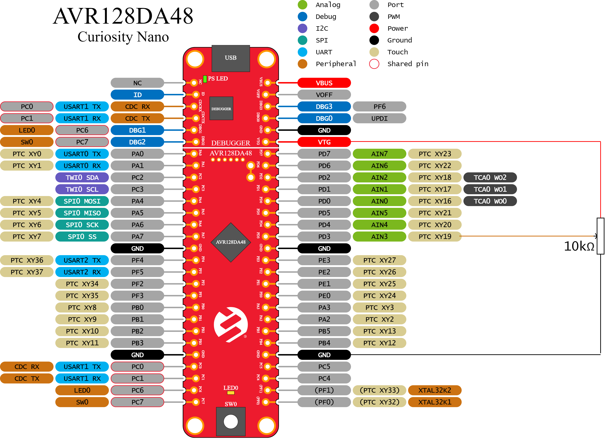

The following MCC configurations must be made for this project:

 - System Module
    1. System clock 4 MHz
    3. WDT disabled

<br>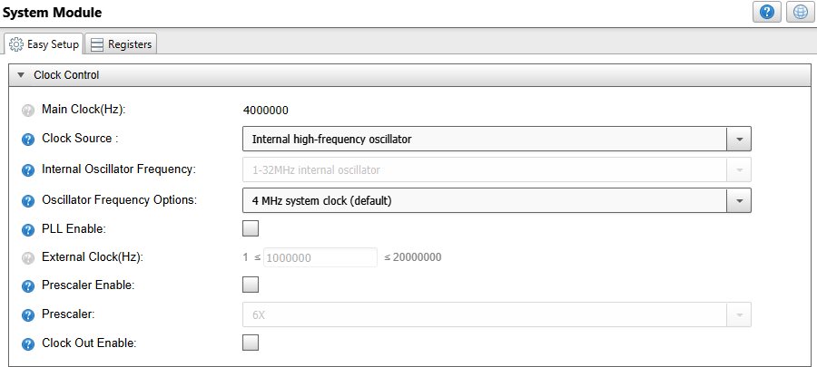

 - ADC0
    1. Input clock is the default 4MHz system clock divided by 2
    2. AIN3 (PD3) is the input of the ADC
    3. 12-bit Resolution mode
    4. Free Running Mode
    5. Samples to accumulate: 64

<br>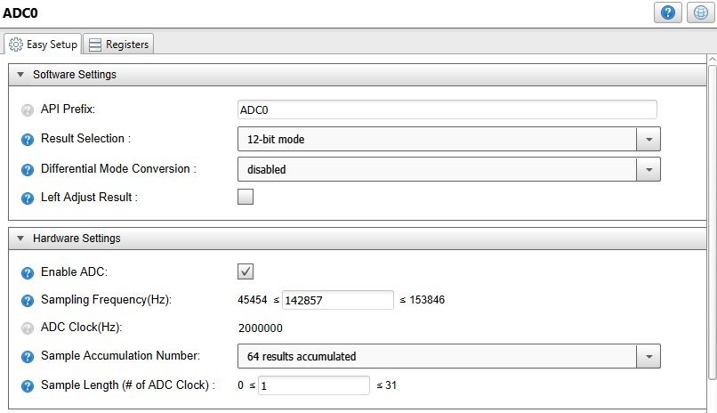
<br>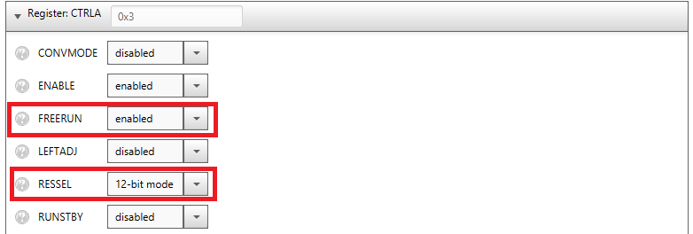
<br>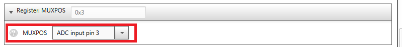

- VREF
    1. VDD reference is selected for ADC0
    2. Enable reference always ON for ADC0

<br>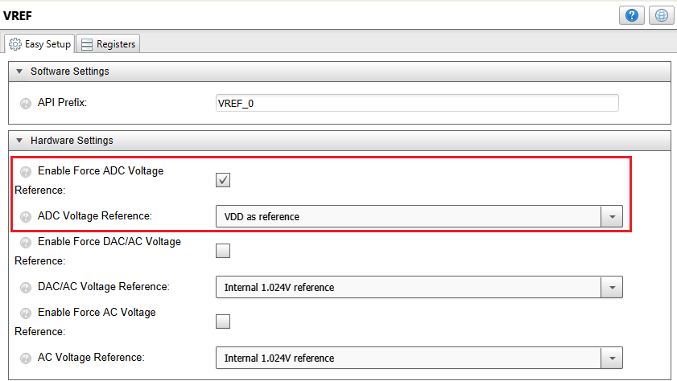

- USART1
    1. TX only
    2. Async mode
    3. Baud Rate: 115200
    4. No Parity, 1 stop bit, 8-bit character size

<br>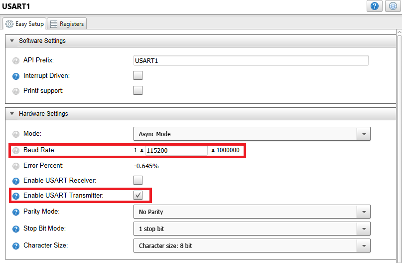

- Pin Manager
    1. PC0 set as Digital output (USART1 - TX)
    2. PC1 set as Digital input (USART1 - RX)
    3. PD3 set as Analog input (ADC input)

<br>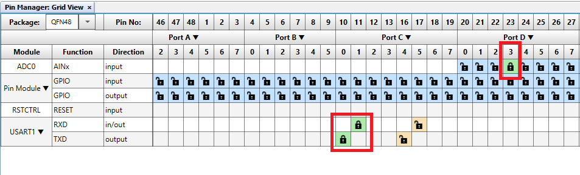
<br>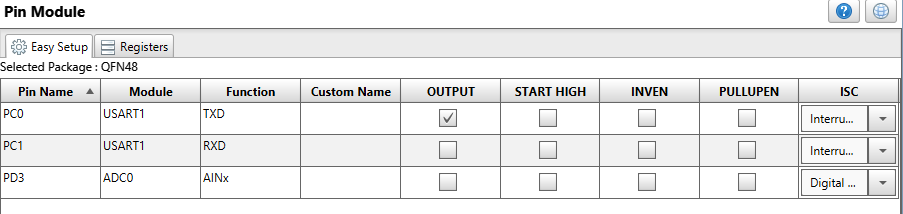


## Demo Code 

The source code for this project can be downloaded from the current page by clicking the "Download" button, or if you want to make your own project, please pay attention to the following steps:
 - After making the MCC settings, press the "Generate" button, and this will generate the required .c and .h files.
 - Then edit the resulting code by adding the following code snippets.
    
    1. In the “main.c” file, at the beginning, after the include section:
        ```
        #define START_TOKEN 0x03 /* Start Frame Token */
        #define END_TOKEN 0xFC /* End Frame Token */
        #define ADC_SHIFT_DIV16 0x04
        ```
    2. In the “main.c” file, inside the while(1) infinite loop:
        ```
        adcVal = ADC0_GetConversion(ADC_MUXPOS_AIN3_gc);
        adcVal = adcVal >> ADC_SHIFT_DIV16;
        USART1_Write(START_TOKEN);
        USART1_Write(adcVal & 0x00FF);
        USART1_Write(adcVal >> 8);
        USART1_Write(END_TOKEN);
        ```

The flow diagram is presented in the picture below:

<br>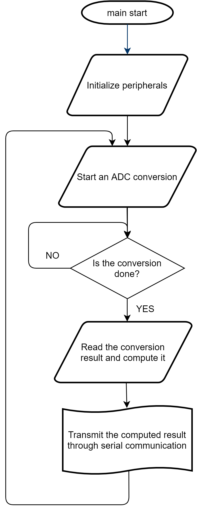

The Software and Hardware is mapped toghether in the Block Diagram below:

<br>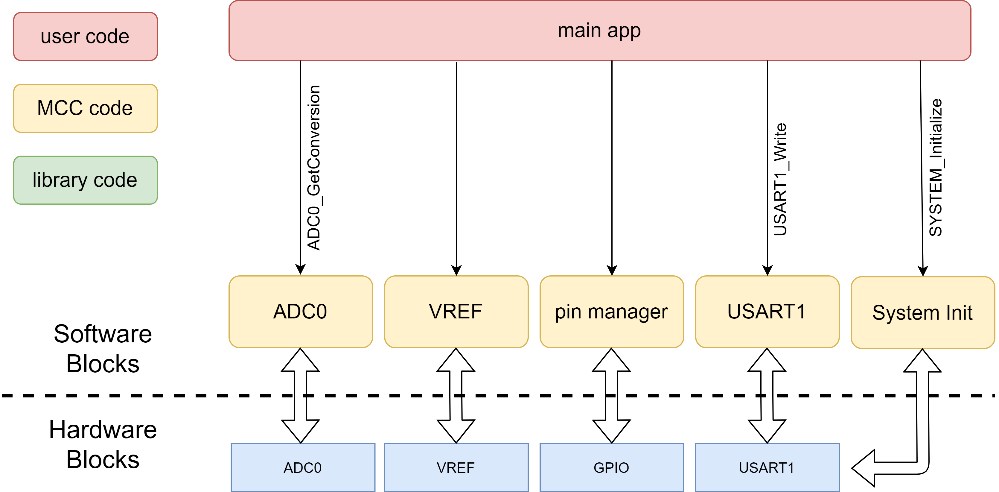

## Operation

1. After making the connections according to the wiring diagram, connect the AVR128DA48 Curiosity Nano Development Board to PC using the USB cable.
2. Build the firmware and load the generated hex file into MCU.
3. Open MPLAB Data Visualizer, configure the serial communication parameters (baud rate 115200, 8 bit character size, 1 stop bit) and create a new variable stream.

## Demo:

After making the setup according to the wiring diagram presented in the Hardware section and uploading the firmware, the ADC will start making continuous conversions with 64 samples acumulated, the core will compute the converion results and transmit them via serial communication with the data visualizer specific format.

In the figure below are presented results obtained using the MPLAB Data Visualizer tool.

<br>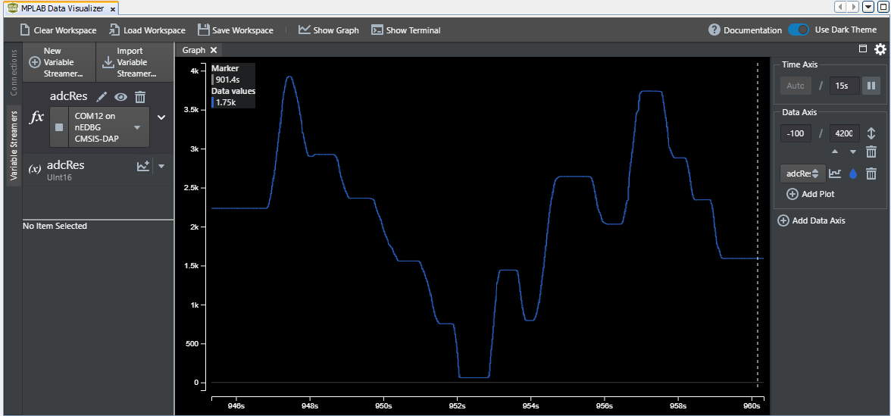

Note: If you want to install MPLAB Data Visualizer, within MPLAB X IDE, go to Tools -> Plugins -> Available Plugins.

## Summary
This example represents a basic implementation of using ADC sample accumlator feature. The analog voltage from a 10 kohm potentiometer will be read using AIN3 channel (corresponding to PD3 pin) by the ADC in Free Running Mode and configured to accumulate 64 samples. The conversion results are computed and sent through USART peripheral and plotted using Data Visualizer tool.
